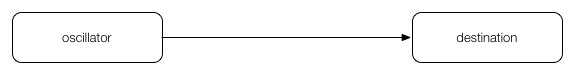
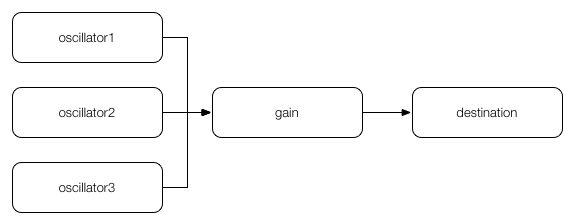
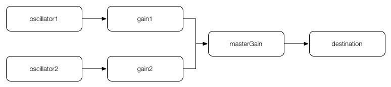
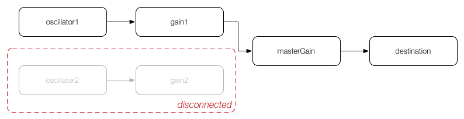
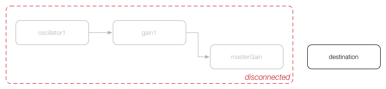
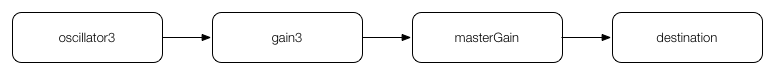
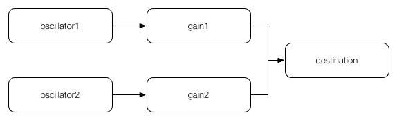

# lesson01

このページではWeb Audio APIを構成する基本コンポーネントと考え方について説明します。

## オーディオコンテキスト

Web Audio APIはオーディオコンテキスト（[AudioContext](http://g200kg.github.io/web-audio-api-ja/#BaseAudioContext)）というオブジェクトを中心にデザインされています。

オーディオコンテキストの主な役割はオーディオノード（[AudioNode](http://g200kg.github.io/web-audio-api-ja/#the-audionode-interface)）を生成するメソッドの提供と、オーディオノードを組み合わせたオーディオグラフにもとづいた音声処理を行うことにあります。

オーディオコンテキストは次のように生成します。ひとつのオーディオコンテキストでも複雑なオーディオグラフを扱えますので、通常はひとつのドキュメント（オーディオアプリケーション）につきひとつのオーディオコンテキストしか必要ありません。


```js
var audioContext = new AudioContext();
```

オーディオコンテキストの主なパラメーターには次のものがあります。たとえば、オーディオコンテキストの経過時刻は`audioContext.currentTime`で参照できます。

| 名前        | データ型           | 説明
|-------------|---------------------|---
| sampleRate  | double              | オーディオコンテキストのサンプルレート
| currentTime | double              | オーディオコンテキストの経過時刻（秒単位）
| destination | AudioDestnationNode | オーディオコンテキストの出力

> #### 補足: SafariのWeb Audio API
> Safariでは`AudioContext`のコンストラクタに`webkit`というプリフィックスが付けられています。つまり、Safariでオーディオコンテキストを生成する場合は`new AudioContext()`ではなく`new webkitAudioContext()`のように書かなくてはなりません。しかし、プリフィックスが必要かどうかを調べて書き方を変えるのは面倒なので、多くの場合はプログラム冒頭に次のようなコードを書いてプリフィックスがなくても`AudioContext`が使えるようにします。  
> ```js
> window.AudioContext = window.AudioContext || window.webkitAudioContext;
> ```

## オーディオノード

オーディオノードは音声処理を行うためのオブジェクトでオーディオグラフの接点（ノード）となります。オーディオノードは大まかに次の4つに分類することができます。

- 信号を生成する**音源**（Source）
- 信号を変化させる**中間**（Intermediate）
- 信号の内容を調べる**分析**（Analyser）
- オーディオグラフの最終地点となる**出力**（Destination）

よく使われるオーディオノードには次のものがあります。

| 名前                   | 用途          | 種類          | 入力 | 出力  | Max/MSP
|------------------------|--------------|:------------:|:----:|:----:|
| OscillatorNode         | オシレーター   | Source       | x    | o     | cycle~, saw~, tri~, rect~
| AudioBufferSourceNode  | バッファー再生 | Source       | x    | o     |noise~, sfplay~
| GainNode               | レベル調整     | Intermediate | o    | o     | *~
| BiquadFilterNode       | フィルター     | Intermediate | o    | o     | biquad~
| DelayNode              | ディレイ       | Intermediate | o    | o     | delay~
| WaveShaperNode         | 非線形変換     | Intermediate | o    | o     | lookup~
| ConvolverNode          | 畳み込み       | Intermediate | o    | o     |
| AnalyserNode           | 波形分析      | Analyser     | o    | o     | scope~, spectroscope~
| AudioDestnationNode    | 出力          | Destination  | o    | x     | dac~

オーディオノードの生成にはオーディオコンテキストのメソッドを使います。

- `audioContext.createOscillator()`
- `audioContext.createBufferSource()`
- `audioContext.createGain()`
- `audioContext.createBiquadFilter()`
- `audioContext.createDelay()`
- `audioContext.createWaveShaper()`
- `audioContext.createConvolver()`
- `audioContext.createAnalyser()`

## オーディオグラフ

オーディオノードは`connect()`メソッドを使って別のオーディオノードと接続することができます。オーディオノードを`connect()`メソッドで音源から出力までネットワーク状に接続したものをオーディオグラフと呼びます。オーディオグラフの最終地点はオーディオコンテキストの出力である`audioContext.destination`となります。

もっとも単純なオーディオグラフは次のように音源と出力が直接接続されているものです。



```js
/* editor */
var oscillator = audioContext.createOscillator();

oscillator.start(audioContext.currentTime);
oscillator.stop(audioContext.currentTime + 1);

oscillator.connect(audioContext.destination);
```

多くの場合では音源と出力の間にいくつかのオーディオノードを接続してもう少し複雑なオーディオグラフを生成します。ひとつのオーディオノードに複数のオーディオノードが接続されている場合は、それらは加算されてから処理されます。次の例では、3和音を1つの`GainNode`に接続して、まとめて音量調整を行っています。



```js
/* editor */
var oscillator1 = audioContext.createOscillator();
var oscillator2 = audioContext.createOscillator();
var oscillator3 = audioContext.createOscillator();
var gain = audioContext.createGain();

oscillator1.frequency.value = 440;
oscillator1.start(audioContext.currentTime);
oscillator1.stop(audioContext.currentTime + 1);
oscillator1.connect(gain);

oscillator2.frequency.value = 550;
oscillator2.start(audioContext.currentTime);
oscillator2.stop(audioContext.currentTime + 1);
oscillator2.connect(gain);

oscillator3.frequency.value = 660;
oscillator3.start(audioContext.currentTime);
oscillator3.stop(audioContext.currentTime + 1);
oscillator3.connect(gain);

gain.gain.value = 1/3;
gain.connect(audioContext.destination);
```

オーディオノードは入力に応じて自動的にモノラルかステレオ（もしくはそれ以上の多チャンネル）に切り替わります。たとえば、モノラル出力の`OscillatorNode`だけが接続された`GainNode`はモノラル出力になります。一方、ステレオミックスの`AudioBuffer`が設定された`AudioBufferSourceNode`はステレオ出力となり、その`AudioBufferSourceNode`が接続された`GainNode`もステレオ出力になります。

## ライフタイム

_注意: ここの記述は仕様に即していますが、実情には即していません。_

オーディオノード同士を接続するのに`connect()`メソッドを使用しました。では、逆に切断するためのメソッドはどうでしょうか。オーディオノードには`disconnect()`という切断用のメソッドもありますが、あまり使われることはありません。というのは、オーディオノードは不必要になった時点で自動的にオーディオグラフから削除されるからです。

たとえば、次のような`oscillator1`と`oscillator2`を音源としたオーディオグラフがあったとします。



`OscillatorNode`は`start()`メソッドで再生を開始して`stop()`メソッドで再生を終了します。ここで`oscillator2`の再生が終了した場合、`oscillator2`と入力のなくなった`gain2`が自動的にオーディオグラフから削除されます。



さらに`oscillator1`の再生も終了した場合、`oscillator1`と`gain1`がオーディオグラフから削除されます。そして、すべての入力がなくなった`masterGain`もオーディオグラフから削除されます。



ただし、オーディオグラフから削除されても接続の情報は残っているので、次に新しい音源が接続されると必要な分のオーディオグラフが復活します。この例では`masterGain`と`destination`の接続が復活します。



ところで、オーディオグラフから削除された`oscillator1`の`start()`メソッドをもう一度呼び出すとどうなるでしょうか。実は、`stop()`メソッドで再生を終了すると、もう一度`start()`メソッドで再生を開始することはできません。なぜならオーディオノードは基本的に使い捨てにされるからです。もう一度`OscillatorNode`を使いたい場合は、新しく生成しなおして、必要なパラメータを設定して`start()`メソッドを呼ぶ必要があります。

一度つくったオーディオノードを再利用しないで、何度も生成しなおすのは非効率に感じるかも知れませんが、Web Audio APIはこの方式で最適化されているので問題ありません。そればかりか、次の例のように音の生成を独立した関数として定義しておくと、発音のたびに関数を呼び出すだけになるのでコードの見通しが良くなります。

```js
/* editor */
function synth(freq, amp) {
  var oscillator = audioContext.createOscillator();
  var gain = audioContext.createGain();

  oscillator.frequency.value = freq;
  oscillator.start(audioContext.currentTime);
  oscillator.stop(audioContext.currentTime + 2.5);
  oscillator.connect(gain);
  oscillator.onended = function() {
    gain.disconnect();
  };

  gain.gain.value = amp;
  gain.connect(audioContext.destination);
}

for (var i = 0; i < 16; i++) {
  var freq = Math.random() * 2000 + 220;
  var amp = 1/16;

  synth(freq, amp);
}
```

> #### 補足: Chromeのライフタイムに関して
> 2016年6月の時点では Chrome 51 のライフタイムがうまく作動していない可能性があります。  
> そのため、プログラムを長時間実行して多くのオーディオノードを生成し続けると、オーディオグラフが徐々に肥大化していき動作が不安定になるようです。このテキストでは対策として、上記の例のように OscillatorNode や AudioBufferSourceNode の onended プロパティを使って、オーディオノードの停止時にオーディオグラフから明示的に削除するようにしています。

## タイミングモデル

Web Audio APIでは正確なタイミングで音を再生したり変化させるために、オーディオコンテキストごとに独立したオーディオスレッドを生成します。オーディオスレッドは独自のタイマーを持っており`audioContext.currentTime`プロパティで経過時刻を**秒単位の浮動小数点数**で参照することができます。Web Audio APIでは、この`audioContext.currentTime`を基準にオーディオノードの処理の開始・終了やパラメーターのスケジューリングといったタイミング制御を行います。

```js
/* editor */
function synth(t0, freq, amp) {
  var t1 = t0 + 2.5;
  var oscillator = audioContext.createOscillator();
  var gain = audioContext.createGain();

  oscillator.frequency.value = freq;
  oscillator.start(t0);
  oscillator.stop(t1);
  oscillator.connect(gain);
  oscillator.onended = function() {
    gain.disconnect();
  };

  gain.gain.value = amp;
  gain.connect(audioContext.destination);
}

for (var i = 0; i < 16; i++) {
  var t0 = audioContext.currentTime + i / 16;
  var freq = Math.random() * 2000 + 220;
  var amp = 1/16;

  synth(t0, freq, amp);
}
```

## 課題

[lesson01](quizzes/lesson01) / [解答例](quizzes/lesson01/answer.html)

タップすると音の出るウェブオーディオアプリケーションです。

1. 次のオーディオグラフを参考にオーディオノードをそれぞれ接続する



---
更新日付：2016-06-10
