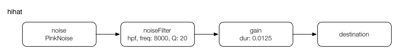
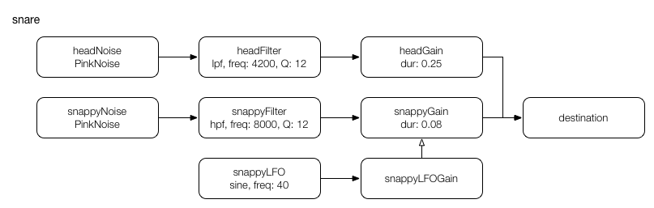
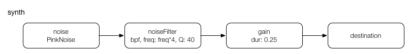

# lesson04

いくつかウェブオーディオアプリケーションを作成すると「Web Audio APIを開始する」「シーケンスパターンのためのスケジューリング」「ノイズを再生する」など、だいたい似たようなパターンのコードを書くことになります。

このページではいくつかのライブラリを紹介します。ここで紹介するライブラリは全てリポジトリのページから "downloads" のリンク先をファイル保存して、次のようにHTMLファイルの`<script>`タグで読み込めるものを集めています。

```html
<script src="/path/to/library-name.js"></script>
```

## start-web-audio

- [start-web-audio](https://github.com/mohayonao/start-web-audio)

iOSにおけるオーディオ制限を緩和するためのライブラリです。iOSではユーザー操作（タップやクリック）を起点としてオーディオを開始する必要があります。この制限のため、たとえばページを開くと自動的に再生が始まるようなページは作ることができません。また、ユーザー操作がきっかけでもタイマーやファイル読み込みなどの非同期処理を経由するとユーザーの操作とみなされなくなります。ただし、一度ユーザー操作によって制限が解除されると、それ以降のオーディオ処理は非同期処理を経由しても動作するようにになります。つまり、最初の再生だけは必ずユーザー操作によってトリガーしないといけません。

iOSで動作しないコード例を示します。

```js
// BAD: 自動再生しようとしている
window.addEventListener("DOMContentLoaded", function() {
  var audioContext = new AudioContext();

  function synth() {
    /* 省略 */
  }

  synth(audioContext.currentTime);
});
```

```js
// BAD: ボタン押下をトリガーとしているが、非同期（タイマー）APIを経由している
var audioContext = new AudioContext();

function synth() {
  /* 省略 */
}

document.getElementById("button").addEventListener("click", function() {
  setTimeout(function() {
    synth(audioContext.currentTime);    
  }, 1000); // 1秒後に再生したい
});
```

```js
// BAD: ボタン押下をトリガーとしているが、非同期（ファイル読み込み）関数を経由している
var audioContext = new AudioContext();

function synth() {
  /* 省略 */
}

document.getElementById("button").addEventListener("click", function() {
  fetchAsAudioBuffer("amen.wav", function(audioBuffer) {
    synth(audioContext.currentTime, audioBuffer);        
  });
});
```

このライブラリはユーザー操作をきっかけに無音の`AudioBufferSourceNode`を再生することで、iOSの制限を解除します。上記最後の例に導入する場合、次の文を追加すると非同期API経由でもWeb Audio APIで再生ができるようになります。

```js
var audioContext = new AudioContext();

// この文を追加する
startWebAudio(audioContext);

function synth() {
  /* 省略 */
}

document.getElementById("button").addEventListener("click", function() {
  fetchAsAudioBuffer("amen.wav", function(audioBuffer) {
    synth(audioContext.currentTime, audioBuffer);        
  });
});
```

## web-audio-scheduler

- [web-audio-scheduler](https://github.com/mohayonao/web-audio-scheduler)

Web Audio APIではタイミング制御を行うときに、すべてのイベントを一度に登録するのではなく、徐々に追加していく方法が推奨されています。

- [2 つの時計のお話 - Web Audio の正確なスケジューリングについて - HTML5 Rocks](http://www.html5rocks.com/ja/tutorials/audio/scheduling/)

この記事の方法をライブラリ化したものが`web-audio-scheduler`です。`web-audio-scheduler`は時間・関数と引数を登録しておくと、内部のタイマーによって指定の時間に関数を実行します。

```js
// オーディオコンテキストを使って WebAudioScheduler インスタンスを生成する
var sched = new WebAudioScheduler({ context: audioContext });

// スケジューラーから呼ばれる関数の定義
function compose(e) {
  var t0 = e.playbackTime; // スケジューリングされた時間
  var args = e.args;       // 引数
  var beat = args.beat;

  // スケジューラーに次のイベントを挿入する
  // この例では1秒後に再び compose() 関数を { beat: beat + 1 } の引数で呼び出す（ループ処理）
  sched.insert(t0 + 1, compose, { beat: beat + 1 });
}

// スケジューラーをスタートする
// ここの引数でスタート時に呼び出される関数と引数を指定できる
sched.start(compose, { beat: 0 });
```

使い方の例を示します。簡単なドラムタブ譜に基づいてリズムパターンを再生しながら更新しています。

```js
/* editor */
var sched = new WebAudioScheduler({ context: audioContext });

var patterns = [
  ["x","-","-","x","-","x","-","-","-","-","-","-","x","-","x","-"],
  ["X","-","x","-","x","-","x","-","x","-","x","-","X","-","x","x"],
  ["-","-","-","-","X","-","-","-","-","-","-","-","X","-","-","-"],
  ["X","-","-","-","x","-","-","-","X","-","x","-","x","-","x","-"],
];

function synth(t0, inst) {
  var t1 = t0 + 0.125;
  var bufSrc = audioContext.createBufferSource();
  var gain = audioContext.createGain();

  bufSrc.buffer = instruments[inst];
  bufSrc.start(t0);
  bufSrc.stop(t1);
  bufSrc.connect(gain);
  bufSrc.onended = function() {
    gain.disconnect();
  };

  gain.gain.value = 0.4;
  gain.connect(audioContext.destination);  
}

function compose(e) {
  var t0 = e.playbackTime;
  var beat = e.args.beat % 16;

  for (var i = 0; i < patterns.length; i++) {
    var x = patterns[i][beat];

    if (x === "x" || x === "X") {
      synth(t0, i + 1);
    }

    if (x !== "X" && Math.random() < 0.025) {
      patterns[i][beat] = patterns[i][beat] === "x" ? "-" : "x";
    }
  }

  sched.insert(t0 + 0.125, compose, { beat: beat + 1 });
}

sched.start(compose, { beat: 0 });
```

## worker-timer

- [worker-timer](https://github.com/mohayonao/worker-timer)

PCブラウザでタイマーAPIを使ったページを開いているときに、別のタブを開いたりブラウザがバックグラウンドに移行すると省力化のためにタイマーの精度が悪くなります。Web Audio APIを使っているときに、タイマー精度が悪くなるとシーケンスパターンのリズムが不安定になるなどの問題が生じます。`worker-timer`は通常のタイマーでは精度が悪くなるケースでも、安定した精度を保つタイマーです。`web-audio-scheduler`は`worker-timer`に対応しており、インスタンス生成を次のように行うと、バックグラウンドに移行しても精度が悪くなることなく安定して動作するようになります。

```js
var sched = new WebAudioScheduler({ context: audioContext, timerAPI: WorkerTimer });
```

## stereo-panner-node

- [stereo-panner-node](https://github.com/mohayonao/stereo-panner-node)

[`StereoPannerNode`](http://g200kg.github.io/web-audio-api-ja/#the-stereopannernode-interface)に対応していないブラウザで`StereoPannerNode`を使うためのポリフィルライブラリです。ポリフィルライブラリとは新しい機能がまだ実装されていないブラウザにその機能を提供するライブラリです。

Safari 9は2016年6月現在でまだ`StereoPannerNode`が使えません。ですが、このライブラリの`polyfill()`関数を使用すると、Safariでも`StereoPannerNode`が使用可能になります。ChromeやFirefoxなどすでに`StereoPannerNode`が使用可能なブラウザでは何もしません。

```js
StereoPannerNode.polyfill();
```

ポリフィル関数を呼び出した後は、オーディオコンテキストの`createStereoPanner()`メソッドで`StereoPannerNode`を生成することができます。

```js
/* editor */
var sched = new WebAudioScheduler({ context: audioContext });

function synth(t0, pos) {
  var t1 = t0 + 0.05;
  var oscillator = audioContext.createOscillator();
  var panner = audioContext.createStereoPanner();
  var gain = audioContext.createGain();

  oscillator.frequency.value = 3520;
  oscillator.start(t0);
  oscillator.stop(t1);
  oscillator.connect(panner);
  oscillator.onended = function() {
    gain.disconnect();
  };

  panner.pan.value = pos;
  panner.connect(gain);

  gain.gain.setValueAtTime(0.2, t0);
  gain.gain.linearRampToValueAtTime(0.0, t1);
  gain.connect(audioContext.destination);
}

function compose(e) {
  var t0 = e.playbackTime;

  synth(t0, Math.sin(t0 * 2));    

  sched.insert(t0 + 0.125, compose);
}

sched.start(compose, { beat: 0 });
```

## noise-node

- [white-noise-node](https://github.com/mohayonao/white-noise-node)
- [pink-noise-node](https://github.com/mohayonao/pink-noise-node)
- [brown-noise-node](https://github.com/mohayonao/brown-noise-node)

ノイズを生成するオーディオノードです。

```js
/* editor */
var sched = new WebAudioScheduler({ context: audioContext });

function synth(t0, amp) {
  var t1 = t0 + 0.05;
  var noise = new WhiteNoiseNode(audioContext);
  var biquadFilter = audioContext.createBiquadFilter();
  var gain = audioContext.createGain();

  noise.start(t0);
  noise.stop(t1);
  noise.connect(biquadFilter);
  noise.onended = function() {
    gain.disconnect();
  };

  biquadFilter.type = "highpass";
  biquadFilter.frequency.value = 10000;
  biquadFilter.Q.value = 12;
  biquadFilter.connect(gain);

  gain.gain.setValueAtTime(amp, t0);
  gain.gain.linearRampToValueAtTime(0.0, t1);
  gain.connect(audioContext.destination);  
}

function compose(e) {
  var t0 = e.playbackTime;

  synth(t0, Math.sin(t0 * 8) * 0.8);    

  sched.insert(t0 + 0.1, compose);
}

sched.start(compose, { beat: 0 });

```

> #### 補足: npmそしてbrowserify
> JavaScriptには今のところモジュールの機能がありません（将来的には追加されます）。
> このページでは`<script>`タグで追加モジュール（外部ライブラリ）を読み込む方法を紹介しました。
> `<script>`タグで機能を分割するのは手軽ですが、規模がある程度大きくなると管理が難しくなります。
> そこで、最近のトレンドとしてブラウザ向けのJavaScriptであっても、[npm](https://www.npmjs.com/)というパッケージ管理やモジュールの仕組みがあるNode.jsで書いて、[browserify](http://browserify.org/)というツールでブラウザ向けに変換する方法が好まれています。

## 課題

[lesson04](quizzes/lesson04) / [解答例](quizzes/lesson04/answer.html)

タップすると音の出るリズムボックスのウェブオーディオアプリケーションです。

1. `index.html`を編集して次の外部モジュールを読み込む
  - `"assets/web-audio-scheduler.js"`
  - `"assets/worker-timer.js"`
  - `"assets/pink-noise-node.js"`
2. `compose()`関数を編集して`0.0625`秒間隔で`compose()`関数を呼び出す
3. 次のオーディオグラフを参考にドラムの音を作る
  - 次のオーディオノードはこのテキストでは扱っていないので適宜調査すること
    - [BiquadFilterNode](http://g200kg.github.io/web-audio-api-ja/#the-biquadfilternode-interface)
    - [WaveShaperNode](http://g200kg.github.io/web-audio-api-ja/#WaveShaperNode)






---
更新日付：2016-06-12
- 2016-06-12：課題の図表を更新
- 2016-06-10：初稿
