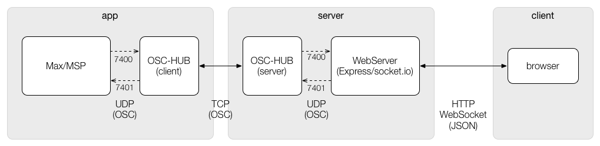

# lesson06

このページではインターネットを経由した外部アプリケーションとの連携について説明します。

## システム構成

lesson05のシステム構成は、同一ネットワーク内にウェブサーバーとコントロール用の外部アプリケーションを設置する構成でした。実際のシステムでは、ウェブサーバーとアプリケーションのネットワークを分離したいことがあります。たとえば、次のようなケースです。

- インスタレーション向けのコントロールアプリケーション
- サーバー上で外部アプリケーション（Max/MSPなど）を動作させるのが難しい

このとき、メッセージのやり取りのためにウェブサーバーとアプリケーションのコンピューターがお互いにアクセスできる経路を用意する必要があります。もっとも単純な解決方法は双方にグローバルIPアドレスを割り当てることですが、もう少し安価に解決する方法として、TCPソケットを経由してメッセージをやり取りする方法があります。システム構成は次のようになります。



このようなシステム構成にすると、ウェブサーバーとアプリケーションのどちらもローカルホスト向けのメッセージングだけで良くなります。つまり、相手のコンピューターがどこにあるのかを考慮する必要がなくなるので「開発中は同一コンピューター内で実行する」「本番環境はネットワークを分離する」といった運用の切り替えが非常に簡単になります。

## サーバーの設定

サーバーには次のような設定が必要です。

### iptables

- [iptables - Wikipedia](https://ja.wikipedia.org/wiki/Iptables)
- [iptablesの設定方法｜さくらインターネット公式サポートサイト](https://help.sakura.ad.jp/app/answers/detail/a_id/2423/~/iptables%E3%81%AE%E8%A8%AD%E5%AE%9A%E6%96%B9%E6%B3%95)

```
-A RH-Firewall-1-INPUT -m state --state NEW -m tcp -p tcp --dport 12345 -j ACCEPT # ウェブサーバー
-A RH-Firewall-1-INPUT -m state --state NEW -m tcp -p tcp --dport 45678 -j ACCEPT # TCPソケット
```

### nginx

- [nginx - Wikipedia](https://ja.wikipedia.org/wiki/Nginx)
- [Using NGINX as a WebSocket Proxy](https://www.nginx.com/blog/websocket-nginx/)

```
server  {
    listen 80;
    server_name app-name.mydomain.com;
    location / {
        proxy_set_header X-Real-IP $remote_addr;
        proxy_set_header X-Forwarded-For $proxy_add_x_forwarded_for;
        proxy_set_header Host $http_host;
        proxy_set_header X-NginX-Proxy true;

        proxy_pass http://127.0.0.1:12345/;
        proxy_redirect off;

        proxy_http_version 1.1;
        proxy_set_header Upgrade $http_upgrade;
        proxy_set_header Connection "upgrade";
    }
}
```

## サーバーのプロセスをdaemon化する

[`forever`](https://github.com/foreverjs/forever)というツールが便利に使えます。コマンドラインから使う場合はnpmでグローバルインストールするのが簡単です。

```
npm install -g install forever
```

foreverを使ってプログラムをdaemonプロセスとして起動するには`start`コマンドを使用します。このとき、`--uid`オプションでプロセスに名前をつけることができるので、指定しておくと良いでしょう。

```
forever start --uid app-name server.js
```

プロセスの停止は`stop`コマンド、再起動には`restart`コマンドを使用します。

```
# 停止
forever stop app-name

# 再起動
forever restart app-name
```

foreverで起動中のプロセスは`list`コマンドで表示できます。

```
forever list
```

主な操作は起動・停止・再起動ですので、Node.jsでのプロジェクトであれば[NPM scripts](https://docs.npmjs.com/cli/run-script)として次の設定をしておくのが便利でしょう。

```
"scripts": {
  "start": "forever start --uid app-name server.js",
  "stop": "forever stop app-name",
  "restart": "forever restart app-name"
}
```

---
更新日付：2016-06-12
